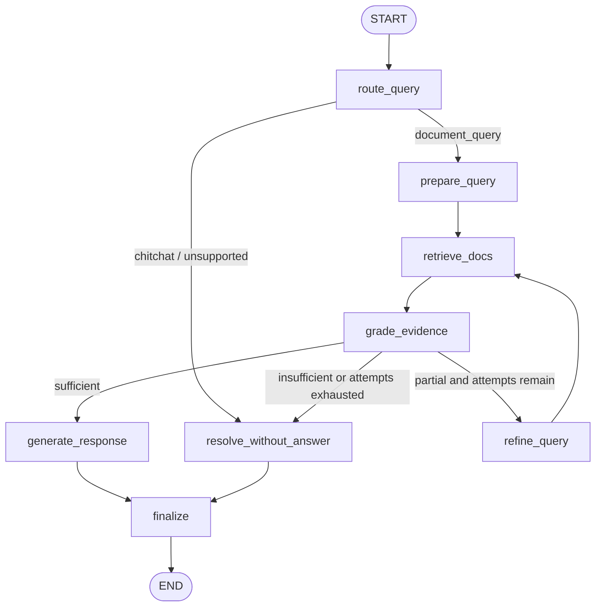

# Grounded-support-RAG

Grounded-support-RAG is a retrieval-augmented support assistant for grounded question answering over multi-document support knowledge bases (MultiDoc2Dial). It turns source content into indexed evidence, runs a LangGraph pipeline that retrieves and grades relevant context for each user turn, and produces grounded answers with citations, traces, and offline evaluation artifacts for debugging and model comparison.

## Scope

- Deterministic data prep: raw dataset loading, section-aware chunking, turn-level example building, stable eval subsets
- Retrieval stack: Postgres + pgvector indexing with provider-swappable embeddings
- Runtime graph: retrieve evidence, decide `answer` / `clarify` / `abstain`, return cited responses, persist traces
- Evaluation: retrieval, generation, grounding, and end-to-end metrics with failure review artifacts
- Local workbench: FastAPI + Jinja2 + HTMX UI over runs, evals, reports, and traces

## Stack

- Runtime: `Python 3.11`, `LangGraph`, `LangChain`
- Retrieval: `Postgres`, `pgvector`
- Providers: `OpenRouter`, `Ollama`
- Workbench: `FastAPI`, `Jinja2`, `HTMX`

## LangGraph Runtime
Runtime behavior:

- Routes the user turn before retrieval
- Builds a search query from conversation context
- Retrieves and grades evidence before generation
- Retries retrieval with query refinement when evidence is partial
- Returns grounded `answer`, `clarify`, or `abstain` outputs with citations and trace artifacts




## Evaluation Snapshot

Best smoke run on the DMV validation subset (`25` examples):

- Chat: `openrouter / openai/gpt-oss-120b:nitro`
- Embeddings: `ollama / qwen3-embedding:4b-q4_K_M`
- `Doc Recall@3 0.760`, `Span Recall@5 0.307`, `MRR@5 0.573`
- `ROUGE-L 0.165`, `F1 0.211`, `Citation Coverage 0.240`, `E2E 0.160`
- `Avg latency 2588 ms`

Eval note: current smoke comparisons used `max_retrieval_attempts = 2`, so retrieval scores still include retry/refinement effects.

## Model Comparison

Recent smoke runs on the same `dmv validation / smoke` subset (`25` examples):

| Chat | Embeddings | Doc R@3 | Span R@5 | MRR@5 | F1 | Citation Cov. | E2E | Avg Latency |
| --- | --- | ---: | ---: | ---: | ---: | ---: | ---: | ---: |
| `openrouter / openai/gpt-oss-120b:nitro` | `ollama / qwen3-embedding:4b-q4_K_M` | 0.760 | 0.307 | 0.573 | 0.211 | 0.240 | 0.160 | 2588 ms |
| `ollama / qwen3:8b-q4_K_M` | `ollama / qwen3-embedding:4b-q4_K_M` | 0.680 | 0.320 | 0.565 | 0.188 | 0.100 | 0.160 | 27430 ms |
| `openrouter / openai/gpt-oss-120b:nitro` | `openrouter / qwen/qwen3-embedding-8b` | 0.160 | 0.120 | 0.110 | 0.099 | 0.000 | 0.040 | 7319 ms |


Conclusions:

- Best practical setup so far is `openrouter / openai/gpt-oss-120b:nitro` + `ollama / qwen3-embedding:4b-q4_K_M`
- Swapping embeddings from `qwen3:8b-q4_K_M` to `qwen/qwen3-embedding-8b` caused the main retrieval collapse
- OpenRouter chat improved latency dramatically over the fully local Ollama path while also improving citation quality


## Run

Setup the local environment:

```bash
uv sync --dev
cp .env.example .env
cp support_graph.toml.example support_graph.toml
docker compose up -d postgres
```

Required local config:

- `.env`: set `SUPPORT_GRAPH_POSTGRES_DSN`
- `.env`: if using OpenRouter for chat or embeddings, set `SUPPORT_GRAPH_OPENROUTER_API_KEY`
- `support_graph.toml`: choose provider combination under `[runtime]`

Then run the pipeline:

```bash
uv run grounded-support-rag build-chunks --domain dmv
uv run grounded-support-rag build-examples --domain dmv --split validation
uv run grounded-support-rag build-subsets --domain dmv --split validation
uv run grounded-support-rag index-docs --domain dmv
uv run grounded-support-rag run --example-id 'dmv::1409501a35697e0ce68561e29577b90a::turn_2'
uv run grounded-support-rag eval --split validation --domain dmv
uv run grounded-support-rag ui --host 127.0.0.1 --port 8008
```
