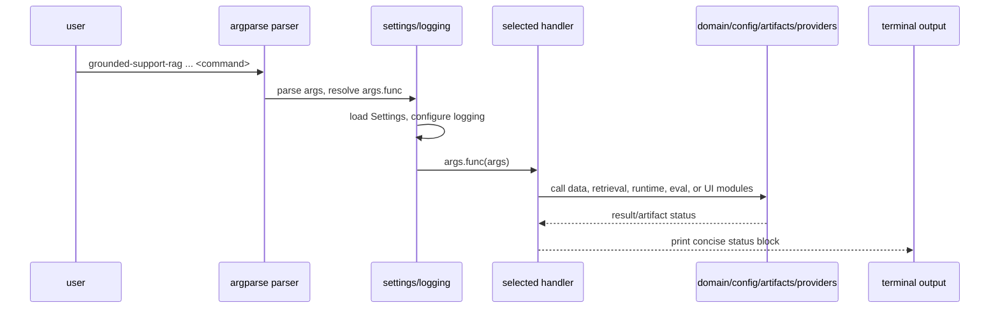

# CLI Handlers

Active source-of-truth for how `grounded-support-rag` commands dispatch into the
application. This is operational CLI documentation, not a Kubernetes baseline or
eval finding.

## Dispatch

Global arguments are declared in `support_graph/cli/parser.py`:

- `--config-file`: optional settings TOML
- `--secrets-file`: optional `.env` secrets file

Subcommands are registered by `build_parser(handlers)`. The parser does not
import command implementations directly; it receives a `CliHandlers` callback
bundle and stores the selected callback on `args.func`.

`support_graph/cli/handlers.py::main` is the runtime entrypoint:

1. Build the parser.
2. Parse global args and the selected subcommand.
3. Load `Settings` from `--config-file` and `--secrets-file`.
4. Configure command logging.
5. Call `args.func(args)`.

## Data Prep

### `fetch-kubernetes-docs`

- For: fetch a pinned `kubernetes/website` docs snapshot.
- Call path: `_fetch_kubernetes_docs` -> `Settings.load` -> `data.kubernetes.fetch_kubernetes_docs`.
- Reads: config for project-root resolution.
- Writes: raw corpus directory, default `raw/kubernetes/current`.
- Use when: bootstrapping or refreshing the local Kubernetes corpus.
- Requirements: network access to the upstream repository; `--replace` required if replacing an existing output dir.

### `build-chunks`

- For: turn raw domain docs into section-aware retrieval chunks.
- Call path: `_build_chunks` -> `load_documents` -> `build_chunks` -> `write_chunks_jsonl`.
- Reads: configured dataset root, domain docs.
- Writes: chunk JSONL, default `data/derived/chunks/<domain>.jsonl`.
- Use when: corpus changed, chunk sizing changed, or chunk artifact missing.
- Requirements: local corpus present.

### `build-subsets`

- For: build deterministic smoke and frozen eval subset JSONL files from examples.
- Call path: `_build_subsets` -> `load_jsonl` -> `build_subset` -> `write_subset_jsonl`.
- Reads: `--examples-file`.
- Writes: `smoke.jsonl` and `frozen_experiment.jsonl` under `--output-dir` or `data/eval_subsets`.
- Use when: deriving stable eval subsets from a larger example file.
- Requirements: input examples with answer-mode rows.

## Index And Model Prep

### `benchmark-embeddings`

- For: measure embedding throughput over a chunk sample.
- Call path: `_benchmark_embeddings` -> runtime index config validation -> `_ensure_chunk_artifact` -> `load_benchmark_chunk_records` -> `benchmark_embeddings`.
- Reads: runtime config, chunk JSONL, embedding provider settings.
- Writes: terminal benchmark report only.
- Use when: estimating full indexing time or checking embedding provider latency.
- Requirements: valid indexing config and embedding provider; may build chunks if missing.

### `index-docs`

- For: populate pgvector from chunk records.
- Call path: `_index_docs` -> runtime index config validation -> `_ensure_chunk_artifact` -> `load_chunk_records` -> `index_documents`.
- Reads: runtime config, chunk JSONL.
- Writes: pgvector collection; may drop/recreate it with `--recreate`.
- Use when: after building chunks, changing embedding model, or creating a fresh local DB.
- Requirements: Postgres/pgvector reachable; embedding provider configured.

### `doctor`

- For: local preflight across config, corpus, chunks, index, and optional eval run artifacts.
- Call path: `_doctor` -> `Settings.load` -> runtime config validation -> `collection_row_count` -> artifact existence checks.
- Reads: settings, dataset root, chunk path, pgvector collection, optional eval run dir.
- Writes: terminal readiness report and exact next commands only.
- Use when: checking whether a local demo or eval run is ready.
- Requirements: Postgres reachable for full index status; no LLM calls, fetches, evals, or mutations.

## Runtime And Eval

### `run`

- For: run the retrieval-backed graph for one stored example.
- Call path: `_run_example` -> runtime config validation -> `load_example_record` -> index preflight -> `run_graph_async` -> `format_run_output`.
- Reads: eval example JSONL/subset files, runtime config, pgvector index.
- Writes: standalone run manifest, result, and trace under `outputs/runs`.
- Use when: inspecting one example with optional `--verbose` evidence and trace detail.
- Requirements: chat provider, embedding provider, Postgres/pgvector index, example record.

### `eval`

- For: run the evaluation harness over a split/subset.
- Call path: `_eval_split` -> runtime config validation -> index preflight -> `evaluate_split_async` -> `format_eval_output`.
- Reads: eval subset/examples, runtime config, pgvector index.
- Writes: eval run artifacts under `outputs/evals/runs/<run-id>`.
- Use when: measuring retrieval, generation, grounding, citations, and failure buckets.
- Requirements: chat provider, embedding provider, Postgres/pgvector index.

### `experiment-smoke10`

- For: run predefined Smoke-10 experiment variants and comparison output.
- Call path: `_experiment_smoke10` -> runtime config validation -> index preflight -> `run_smoke10_experiment_async` -> `format_experiment_output`.
- Reads: smoke eval subset, runtime config, pgvector index.
- Writes: experiment/eval artifacts from the evaluation module.
- Use when: comparing graph variants on a small stable subset.
- Requirements: chat provider, embedding provider, Postgres/pgvector index.

## Inspection

### `review-failures`

- For: inspect failure examples and review artifacts from one completed eval run.
- Call path: `_review_failures` -> `_required_eval_run_dir` -> `load_jsonl(failures.jsonl)` -> `format_review_failures_output`.
- Reads: `outputs/evals/runs/<run-id>/failures.jsonl` and sibling artifacts.
- Writes: terminal failure summary only.
- Use when: filtering failures by label, target mode, or display limit.
- Requirements: complete eval run artifacts.

### `trace-show`

- For: inspect the trace summary for one evaluated example.
- Call path: `_trace_show` -> `_required_eval_run_dir` -> `trace_index.json` lookup -> `load_trace_events` -> `summarize_trace_events` -> `format_trace_show_output`.
- Reads: eval run `trace_index.json` and selected trace JSONL under `traces/`.
- Writes: terminal trace summary only.
- Use when: debugging graph path, decision points, and latencies for one example.
- Requirements: complete eval run artifacts with trace files.

## Eval Authoring

### `draft-eval-examples`

- For: draft corpus-grounded eval candidate rows from seed topics.
- Call path: `_draft_eval_examples` -> runtime config validation -> index preflight -> `load_seed_topics` -> `build_chat_model` -> `draft_examples` -> `append_candidate_rows`.
- Reads: seed JSONL, runtime config, pgvector index.
- Writes: candidates JSONL, default `data/eval_subsets/<domain>/_candidates/expanded.candidates.jsonl`.
- Use when: generating candidate examples for human review before validation/promotion.
- Requirements: chat provider with structured output, embedding provider, Postgres/pgvector index.

### `validate-eval-examples`

- For: validate curated eval examples against the pinned chunk corpus.
- Call path: `_validate_eval_examples` -> `_resolve_chunk_file` -> `load_examples` -> `load_subset_jsonl` -> `build_chunk_index` -> `validate_examples`.
- Reads: examples JSONL and chunk JSONL.
- Writes: terminal validation report only.
- Use when: checking candidates or final subsets before eval/promotion.
- Requirements: local chunk artifact; no provider calls.

### `promote-eval-examples`

- For: merge verified candidates into the final expanded subset.
- Call path: `_promote_eval_examples` -> `_resolve_chunk_file` -> `load_examples` -> `validate_examples` -> `promote_examples`.
- Reads: candidates JSONL, chunk JSONL, optional existing target file.
- Writes: target subset JSONL, default `data/eval_subsets/<domain>/expanded.jsonl`.
- Use when: moving reviewed candidates into the eval suite.
- Requirements: local chunk artifact and validation-clean candidates; no provider calls.

## Variance And Model Gates

### `eval-variance`

- For: repeat eval runs to attribute metric variance and assert deterministic retrieval.
- Call path: `_eval_variance` -> runtime config validation -> index preflight -> `load_eval_examples` -> `build_eval_config` -> `run_variance_study_async` -> `write_variance_report`.
- Reads: eval subset, runtime config, pgvector index.
- Writes: repeated eval artifacts and a variance report.
- Use when: estimating recommended repeat count or separating generation variance from retrieval drift.
- Requirements: chat provider, embedding provider, Postgres/pgvector index.

### `model-ab-compatibility`

- For: gate a candidate OpenRouter chat model before model A/B work.
- Call path: `_model_ab_compatibility` -> runtime config validation -> index preflight -> `load_eval_examples` -> `build_eval_config` -> `run_compatibility_gate_async`.
- Reads: eval subset, runtime config, pgvector index.
- Writes: compatibility gate eval artifacts and terminal pass/fail report.
- Use when: confirming candidate structured-output support and fallback tolerance.
- Requirements: OpenRouter candidate chat model, embedding provider, Postgres/pgvector index.

## Workbench

### `ui`

- For: serve the local SupportGraph Workbench.
- Call path: `_serve_ui` -> `Settings.load` -> `support_graph.ui.create_app(build_loader(settings))` -> `uvicorn.run`.
- Reads: local settings and existing run/eval/report/trace artifacts through the UI loader.
- Writes: no CLI artifacts directly; live UI actions may create standalone run artifacts.
- Use when: browsing runs, evals, reports, traces, and live examples in a local web UI.
- Requirements: `uvicorn` app dependencies; provider/index requirements depend on UI action.

## Command List

Current parser commands:

- `fetch-kubernetes-docs`
- `build-chunks`
- `build-subsets`
- `benchmark-embeddings`
- `index-docs`
- `run`
- `eval`
- `experiment-smoke10`
- `review-failures`
- `trace-show`
- `ui`
- `draft-eval-examples`
- `validate-eval-examples`
- `promote-eval-examples`
- `eval-variance`
- `model-ab-compatibility`
- `doctor`
